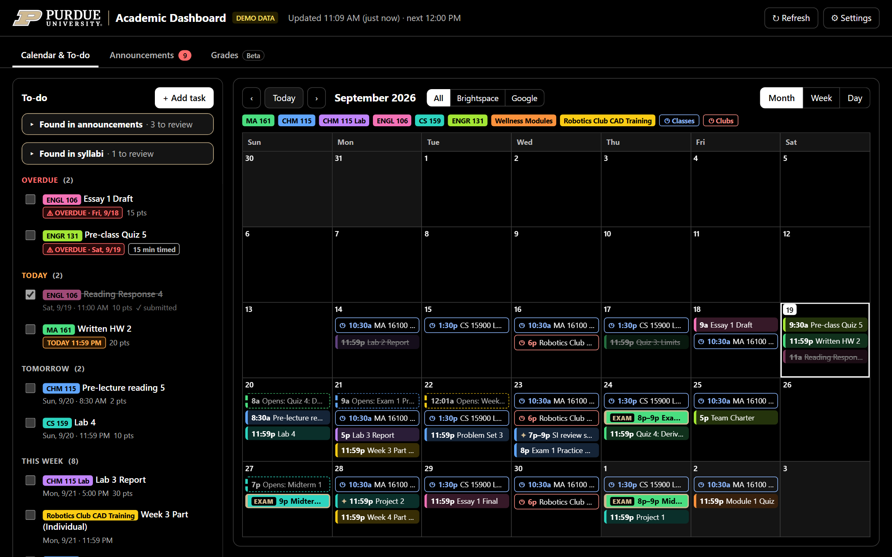
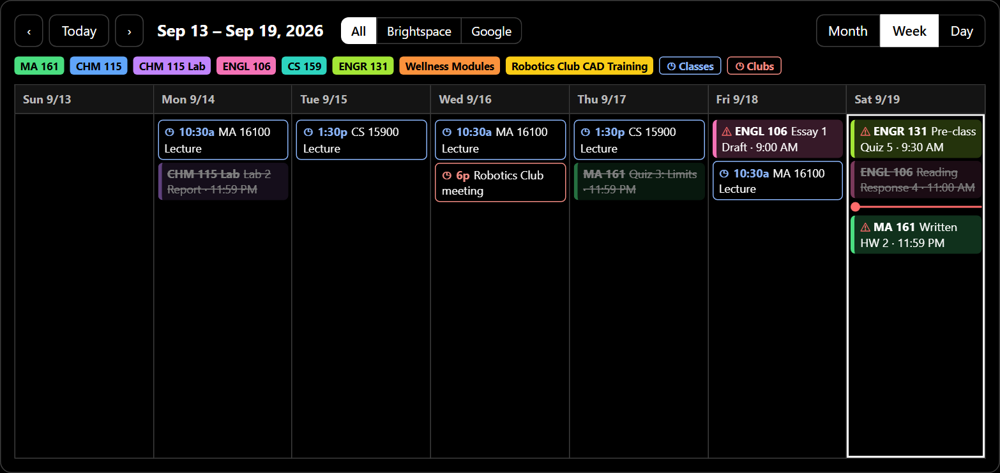
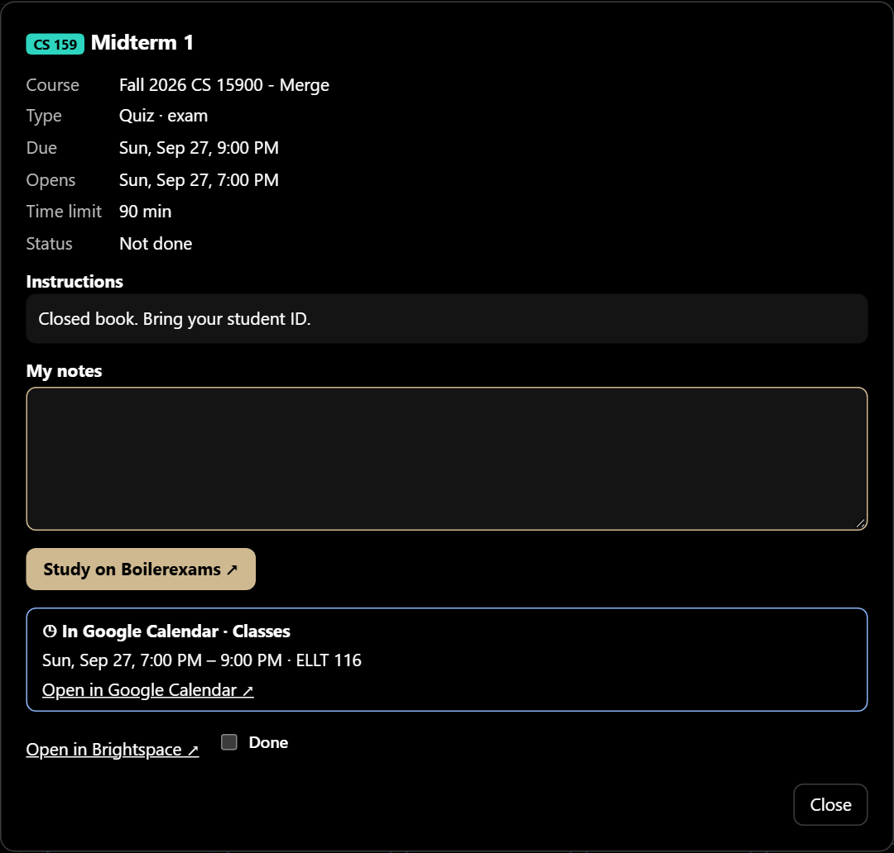
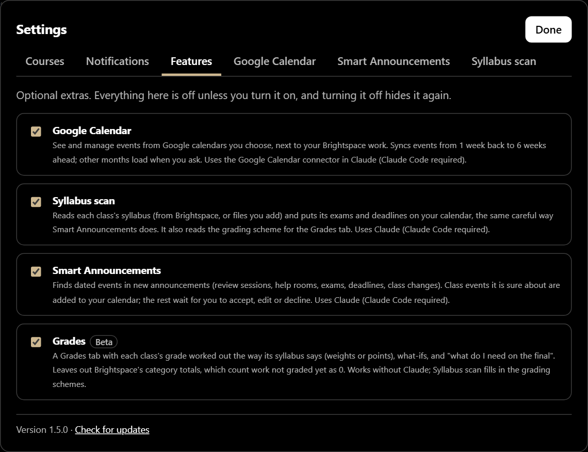
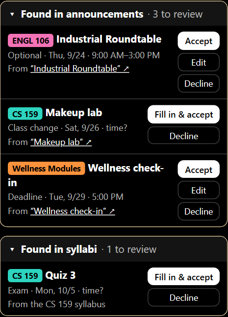
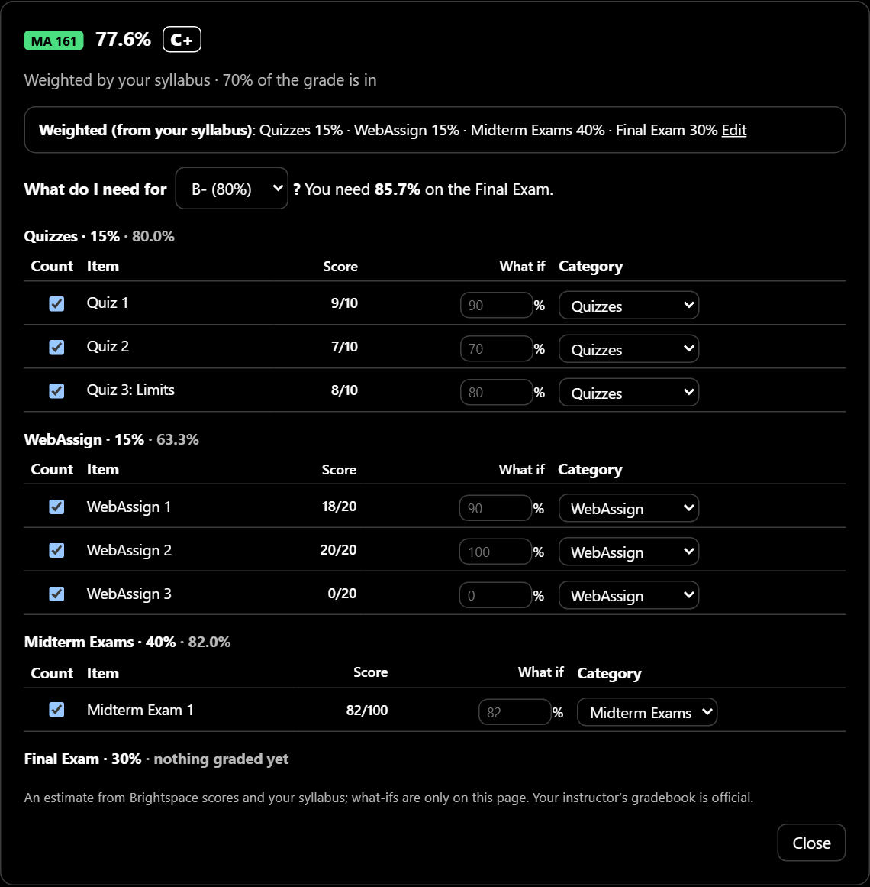

<div align="center">

# Academic Dashboard

**Everything due in your Purdue Brightspace courses: one calendar, one to-do list, one notification a day.**<br>
Runs privately on your own PC and opens in your browser.

[](../../releases/latest)   [](LICENSE)

[**Install**](#install-with-an-ai-agent-easiest-10-minutes) · [Features](#features) · [Using it](#using-it) · [Optional features](#optional-features) · [Troubleshooting](#troubleshooting)



<sub>Screenshots use the built-in demo (made-up courses).</sub>

</div>

## Features

- **To-do list**: overdue, due today, tomorrow and this week, with a checkbox to mark things done. Submitted assignments tick themselves.
- **Calendar** (month, week or day): every due date, color-coded by course, plus **when quizzes open**.
- **Exams stand out in gold**: exam quizzes, *and* exam dates your instructors post in announcements, are found automatically.
- **Your own tasks**: homework on other sites (WebAssign, Achieve…), exams, anything Brightspace doesn't track.
- **Announcements** tab with unread counts.
- **Windows notifications**: when your PC starts and every 3 hours, one notification lists what's due today and early tomorrow morning.
- **Updates itself**: when there's a new version, one click installs it and keeps your data.

It refreshes from Brightspace **every 3 hours and at midnight** by itself. Everything stays on your computer, and the dashboard never sees your password.

<p align="center"><br><sub><b>Week view</b>, with a line at the current time. <b>← →</b> move it, <b>↑ ↓</b> switch Month / Week / Day.</sub></p>

> **Windows 10/11 only.** Works in any browser (Chrome, Edge, Firefox).

---

## Install with an AI agent (easiest, ~10 minutes)

Works with **[Claude Code](https://claude.com/claude-code)** or **OpenAI Codex** (app, CLI or IDE extension). You need an account with one of them.

1. **Download** `academic-dashboard.zip` from the [latest release](../../releases/latest), right-click it → **Extract All**, and put the folder somewhere like your Desktop.
2. **Open the folder in your agent:**
   - Claude Code desktop app / Codex app: start a new session in the `academic-dashboard` folder.
   - Terminal: open Command Prompt, `cd` into the folder, then run `claude` or `codex`.
3. **Type:**
   > Set up the academic dashboard

The agent follows the step-by-step instructions in `AGENTS.md`. It installs Node.js if you don't have it, installs and self-tests the dashboard, connects your Brightspace account, sets it to start with Windows, and opens it.

**What you do yourself:**
- **Approve** the commands it asks to run. Codex asks before anything that needs the internet or runs outside its sandbox; that's expected, so say yes.
- **Sign in to Purdue once**, in a small black window the agent opens. Type your password *there*, never in the chat, and approve the number on your phone. The login is stored in Windows Credential Manager.
- If the agent says its sandbox can't start the dashboard, **double-click `install-autostart.cmd`** in the folder yourself.

When it's done, bookmark **http://localhost:4321**.

<details>
<summary><b>Install by hand instead</b></summary>

1. **Node.js**: install the **LTS** version from https://nodejs.org (default options). Check it in Command Prompt: `node --version` should print v20 or higher (v22 or higher to read PDF syllabi with Syllabus scan).
2. **Connect Brightspace** (one time). In Command Prompt:
   ```
   npx -y brightspace-mcp-server@latest setup --purdue
   ```
   Type `y` if asked to install it, enter your Purdue login **in that window**, choose **number matching / approval** for MFA, and approve on your phone. Offers to set up AI apps are optional.
3. **Get the dashboard**: download `academic-dashboard.zip` from the [latest release](../../releases/latest) and extract it (e.g. to your Desktop).
4. **Install and test it**:
   ```
   cd %USERPROFILE%\Desktop\academic-dashboard
   npm install
   npm test
   npm run check
   ```
   `npm test` should end with `fail 0`; `npm run check` should say `OK: connected to Brightspace`.
5. **Start it with Windows**: double-click **`install-autostart.cmd`**. It opens http://localhost:4321. The **first load takes about 2 minutes** (Brightspace is slow); after that it updates in the background.
   (Rather start it by hand each time? Use `start.cmd` instead.)

</details>

**Updating:** when a new version is out, **Update available** appears at the top of the dashboard. Click it, then **Update now**; your data is kept. Coming from v1.4 or older? Update once the old way: ask your agent to "update the dashboard". After that it's one click.

---

## Using it

| Want to… | Do this |
|---|---|
| Mark something done | Tick its checkbox (untick to undo) |
| See details / instructions | Click the item |
| Add your own notes to an assignment or exam | Click it and type in **My notes**. Markdown works (**bold**, lists, `- [ ]` checklists, links). Saves automatically; items with notes show a “note” tag |
| Add your own task | **+ Add task**, press **N**, or click an empty hour in Day view. Add an **End date** for something that spans days (e.g. Sat–Sun). Tick **This is an exam** for exams. |
| Edit or delete your task | Click it |
| Jump to today | **Today**, or press **T** |
| Move the calendar | **‹ ›**, or the **← →** arrow keys (a month, week or day at a time) |
| Switch Month / Week / Day | Click it, or press **↑ ↓** |
| See one day hour by hour | **Day**, or click a day (its number, empty space, or **+N more**) in Month/Week |
| Hide or show a course | **⚙ Settings → Courses** |
| Hide a course (or Google calendar) on the calendar only | Click its badge above the calendar; click again to bring it back |
| Notifications on/off, or a test | **⚙ Settings → Notifications** |
| Turn optional features on or off | **⚙ Settings → Features** |
| Update right now | **↻ Refresh** (about 2 minutes) |



**Colors:** each course has its own color. Urgency always appears as a labeled badge: red **OVERDUE** and orange **TODAY** (anything later just shows its date and time). **Gold = exam.** A dashed outline on the calendar means "**opens** at this time".

**Study on Boilerexams:** exams in courses that [Boilerexams](https://boilerexams.com/courses) covers get a gold **Study on Boilerexams** button in their details, linking to that course's practice exams. It's checked automatically, including for new exams.

**Exams** are picked up from quizzes named like "Exam 2" or "Midterm" (not practice quizzes), and from announcements that schedule one (e.g. *"Exam 1 is Thurs. Sept. 24, 8:00-9:00 PM"*). Mentions of an exam inside a deadline ("sign up for a seat by…", "Exam Agreement due…") are ignored. If an exam is missing, add it yourself and tick **This is an exam**.

**Which courses show up:** your registered classes for the current semester always do. Other Brightspace sites (orientation, clubs, trainings, newsletters) show only while they have something due in the next 30 days. Override in **⚙ Settings → Courses**.

**Notifications** come from Windows itself, so they work even with the browser closed. You get one when your PC starts and after each 3-hour refresh, listing unfinished things due **today** or **before 10 AM tomorrow**; if nothing's due, you get nothing. **Clicking it opens the dashboard right at those items** (a single item opens its details).

**Overdue items** stay listed for 14 days, then drop off. Tick one to dismiss it sooner.

<br clear="right">

---

## Optional features

All off by default. Turn them on in **⚙ Settings → Features**; turning one off hides it again.

<p align="center"></p>

The three that read text with AI (Google Calendar, Smart Announcements, Syllabus scan) need **[Claude Code](https://claude.com/claude-code)** installed and signed in, and use a small amount of your Claude usage. **None of them adds anything twice:** anything already on your calendar is skipped. That covers Brightspace items, announced exams, each other's finds, your own tasks, and Google events whose title names the class. If you add a task for something they found, it shows once, as your task.

### Google Calendar
Shows events from the Google calendars you pick next to your Brightspace work, outlined (◷) so they never look like assignments. **All · Brightspace · Google** above the calendar switches between them. You can create, edit and delete events on calendars where you turn on **Allow edits**, and send an assignment or exam to Google from its details. It needs the **Google Calendar connector** connected in Claude (claude.ai → Settings → Connectors). It syncs every 6 hours and on **Sync now**, for about $0.02–0.10 per sync on the cheapest model. Your events pass through Claude; nothing else leaves your PC.

### Smart Announcements and Syllabus scan



**Smart Announcements** reads your announcements from the last 2 weeks, and new ones as they arrive, and finds dated events: review sessions, help rooms, exams, deadlines (including ones not in Brightspace, like a lab's pre-lab), class changes. Events from your classes that it's sure about go straight on the calendar, marked ✦. Optional events (career fairs, workshops, club events) and anything missing a time or place wait in **Found in announcements** above your to-do list. There you can **Accept**, **Edit** or **Decline** them. About $0.03–0.06 for the first 2 weeks, then a cent or two per new announcement.

**Syllabus scan** reads each class's syllabus. That's both what Brightspace has (the course overview and any file called "Syllabus" or "Course Schedule") and files you add (drop PDFs, Word files or saved web pages into ⚙ Settings → Syllabus scan; the class is recognized from the file name). Every dated exam, quiz, deadline and no-class day goes on your calendar the same careful way. Anything it isn't sure about waits in **Found in syllabi**, with **Accept all** for long lists like weekly lab deadlines. It also reads each class's grading scheme for Grades. About $0.05–0.25 for a whole term; it only re-reads a class when you add a file or click Rescan. Reading PDFs needs Node.js 22 or newer.

Both send the text to Claude with **no tools**, so it can only suggest events, and every suggestion is checked against the original text before it's used. Anything added can be removed from its details.

<br clear="right">

### Grades (beta)



A **Grades** tab with each class's grade worked out the way its syllabus says: weighted categories or total points.

Brightspace's own numbers are often misleading. Its category totals count work that isn't graded yet as 0, so those totals are left out here (shown faded; you can count any row back in).

Open a class and you can:
- set up its grading once (or, with Syllabus scan on, click **Use this** on what the syllabus says);
- try **what-if** scores;
- leave out a zero that just isn't graded yet;
- see **what you need** for the grade you want.

Nothing here uses Claude. It's an estimate; your instructor's gradebook is official.

<br clear="right">

---

## Troubleshooting

**Red banner: "Brightspace sign-in needed"**: your Brightspace login expired. A sign-in window opens by itself: approve the number on your phone, and the dashboard refreshes when the window closes. Automatic refreshes pause until then, so your phone doesn't get MFA prompts at 3 AM. If you closed the window, click **Sign in** to open it again.

**Yellow banner: "Couldn't reach Brightspace"**: usually no internet. It keeps showing your last data and retries in 5, 15, then 30 minutes.

**No notifications**: open **⚙ Settings → Notifications**. If Windows is blocking them, it says so and has a button that opens the right Windows setting: turn **Notifications** on (and **Windows PowerShell**, which the dashboard uses to show them). Then click **Send a test notification**. With Do Not Disturb on, they go quietly to the notification center.

**Page won't load**: double-click `start.cmd`. If it still fails, look at `data\server.log`.

**Port 4321 is used by another program**: run `setx DASH_PORT 5055` in Command Prompt, then `stop.cmd` and `start.cmd`, and use http://localhost:5055.

**A class's homework is missing**: some classes keep homework on outside sites that Brightspace doesn't list. Add those as your own tasks.

## Stop / uninstall
- **Stop:** `stop.cmd` · **Remove auto-start:** `uninstall-autostart.cmd` · **Remove everything:** remove auto-start, then delete the folder.
- To also remove the saved Brightspace login: *Credential Manager → Windows Credentials*, delete the `brightspace-mcp` entries.

## Try it without an account
`npm run demo` shows made-up courses at http://localhost:4321 (kept separately in `data-demo\`; your real data isn't touched). Stop with `Ctrl+C`.

## Privacy & security
- Runs only on `127.0.0.1`, so other devices on your Wi-Fi can't open it. Other websites can't call its API.
- Your data (cache, tasks, checkmarks, settings, log) lives in `data\` inside the folder. Don't share that folder when you pass the dashboard on; share the release zip instead.
- Your password is handled only by [brightspace-mcp-server](https://github.com/RohanMuppa/brightspace-mcp-server) and Windows Credential Manager.

## About the Purdue logo
The header shows the Purdue University logo (`public/purdue-logo.svg`, from Wikimedia Commons, recolored for the dark background). It's a Purdue trademark, used here only to mark this as a student-made tool for Purdue students. It is **not** an official Purdue product. To remove it, delete the `` line in `public/index.html`.

<details>
<summary><b>For developers</b></summary>

- `npm test`: unit tests (`test.mjs`) plus integration tests: the real server against a fake Brightspace (`test-server.mjs`), and each optional feature and the updater against fakes (`test-gcal.mjs`, `test-smart.mjs`, `test-syllabus.mjs`, `test-grades.mjs`, `test-update.mjs`).
- `test-e2e*.mjs`: browser click-throughs in Firefox and Chromium (need Playwright; see the file headers).
- Code: `server.mjs` (server, scheduler, notifications) · `brightspace.mjs` (fetching over MCP) · `logic.mjs` (all rules; shared by server, page and tests) · `toast.mjs` (Windows notifications) · `update.mjs` (in-app updates) · `smart-ann.mjs`, `syllabus.mjs`, `gcal-routes.mjs` (optional features) · `public/` (page, plain HTML/CSS/JS, no build step).
- Design: `spec.md`, plus `spec-google-calendar.md`, `spec-smart-announcements.md`, `spec-next-features.md`. Agent instructions: `AGENTS.md`.
- README screenshots (`docs/screenshots/`) come from `npm run demo`.

</details>

---

<div align="center">
Made by <a href="https://lucasflowers.net">Lucas Flowers</a> · not affiliated with Purdue University
</div>
